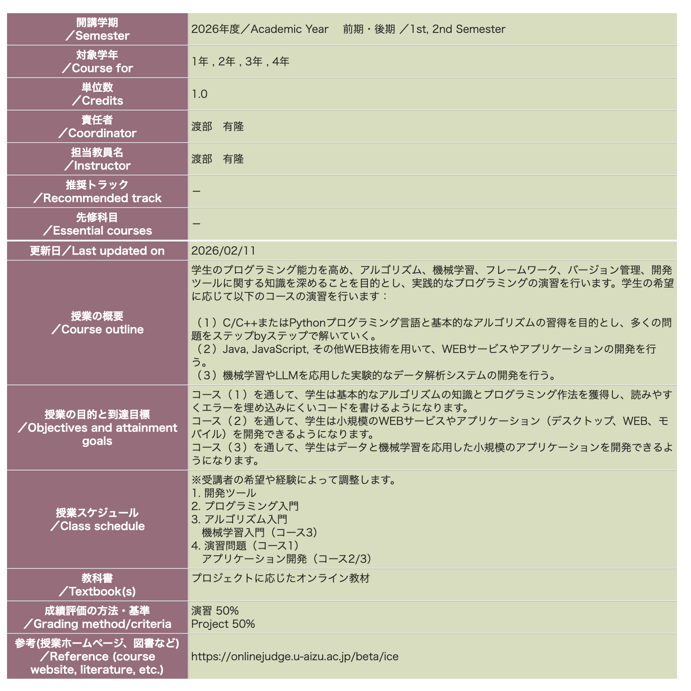

# 授業概要

2026年度前期「実践的プログラミング」へようこそ！

## この授業について

本授業は、プログラミングの基礎を学び、実践的なプログラムを作成するための技術を身につけることを目的としています。

### 前期の内容（本講義）

**C/C++プログラミング言語と基本的なアルゴリズムの習得**を目的とし、多くの問題をステップbyステップで解いていきます。

- C言語の基礎文法
- データ構造（配列、構造体、ポインタ）
- 基本的なアルゴリズム（ソート、探索など）
- メモリ管理の基礎

### 後期の内容（予定）

**Java, JavaScript, その他WEB技術を用いて、WEBサービスやアプリケーションの開発**を行います。

- Webの基礎知識（HTML, CSS, JavaScript）
- フロントエンド開発
- バックエンド開発（Java/Node.js）
- データベース連携

## 講師

**伊藤 航大**

## SA（スチューデント・アシスタント）

**手塚 大地**

質問や相談があれば、授業中やSlackで気軽に声をかけてください。

## 生成AIについて
- 生成AIを使用する場合は、生成AIの使用に関する[ルール](https://u-aizu.ac.jp/files/cd87075ead451e35bcfebed5b79f71c88450a7d1.pdf)を守ってください
- 演習の際に生成AIを使用すること自体は問題ありません。しかし、すべて生成AIを使用したコードをそのまま提出することは禁止します。この授業は卒業認定単位を取得するための授業ではなく、課外授業として勉強するものです。そのため、生成AIを使用してコードを書いても、そのコードを理解していないと意味がありません。生成AIを使用してコードを書いた場合は、そのコードを理解し、自分で書き直して提出してください

## 連絡方法・使用するツールについて

### Slack

この授業ではSlackを使って連絡を取ります。

- 授業に関する質問
- 課題についての相談
- 技術的なディスカッション

#### Slackに参加しよう

初回講義で招待リンクを共有します。必ず参加してください。

https://join.slack.com/t/2026-wfa7449/shared_invite/zt-3un9r7t86-chTnC3C8u1GDmJbyWdRrvA

### AOJ

AOJ は、プログラミングの問題を解くためのオンラインジャッジです。AOJを演習問題として使用します。AOJで問題を解いて、提出してください。

## アンケート

授業の進め方や内容についてのアンケートを実施します。アンケートの結果をもとに、授業の改善を行います。アンケートとテストには、率直な意見を書いてください。

アンケートとURLは、[こちら](https://docs.google.com/forms/d/e/1FAIpQLSey9eBSiUOTql3L5j-BfZtgSBRLV9R-EpWiUs9UEIJYPl5lhw/viewform?usp=publish-editor)です。

