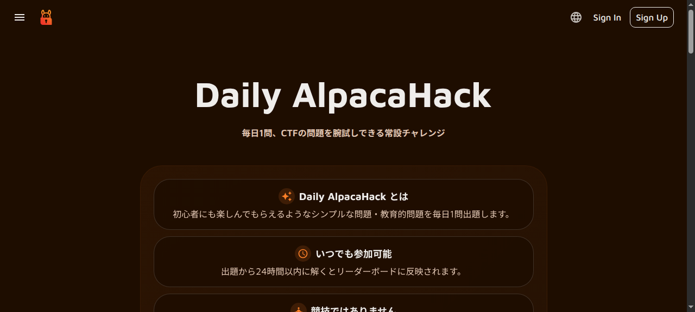
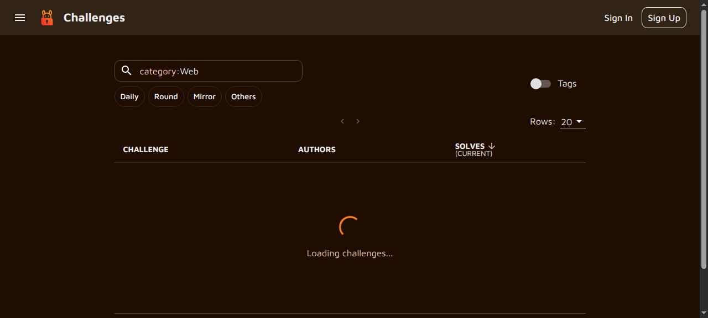
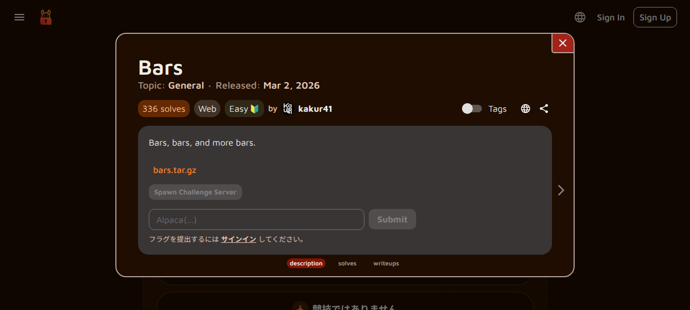
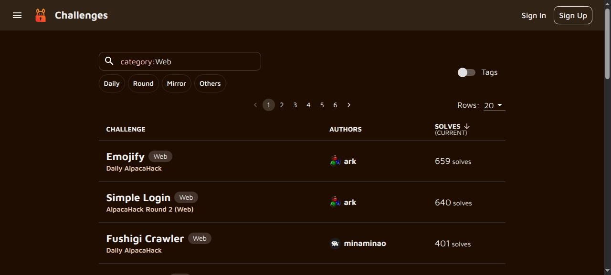

# Web CTFとは

:::danger 倫理的注意事項
ここで学ぶ技術は、**CTFの範囲内でのみ**使用してください。許可なく他人のシステムを攻撃することは**不正アクセス禁止法**で禁じられています。演習問題は必ずAlpacaHackなどの公式プラットフォーム上で解いてください。
:::

## 講義室の要件

- **インターネット接続**: 必須（AlpacaHackへのアクセス）
- **プロジェクター**: 講師用（スクリーンショットの表示）
- **学生PC**: 各自のPC持参を推奨（ブラウザ、curlが動作する環境）
- **ネットワーク帯域**: 学生全員が同時にWebサイトにアクセスできる帯域

## 事前準備チェックリスト

講義前に以下を準備してください：

- [ ] AlpacaHackアカウントの作成（[https://alpacahack.com/signup](https://alpacahack.com/signup)）
- [ ] curlのインストール（Windows: Git Bash、Mac: `brew install curl`、Linux: `sudo apt install curl`）
- [ ] ブラウザの開発者ツールの確認（`F12` で開けることを確認）

## 想定学習時間

- **講義**: 約45分
- **演習**: 約30分
- **合計**: 約75分

## セキュリティの基本概念: CIAトライアド

Webセキュリティを理解する前に、**CIAトライアド**という基本概念を知っておきましょう：

- **機密性（Confidentiality）**: 許可されたユーザーだけが情報にアクセスできる
- **完全性（Integrity）**: 情報が不正に改竄されない
- **可用性（Availability）**: 必要な時にシステムが利用できる

今回の講義で学ぶ攻撃手法は、これらのいずれかを侵害するものです。

## 攻撃者の動機

攻撃者には様々な動機があります：

- **犯罪者**: 金銭目的（個人情報窃取、ランサムウェア）
- **ハクティビスト**: 政治的目的（プロテスト、情報公開）
- **内部関係者**: 不満・利益（退職前のデータ持ち出し）
- **国家関与**: 諜報活動、サイバー戦争

CTFでは、これらの攻撃手法を**防御の観点**から学びます。

## CTF（Capture The Flag）

CTFは、セキュリティの技術を競う**サイバーセキュリティコンテスト**です。

出題される問題には様々なカテゴリがあり、脆弱性を探して隠された「flag」という文字列を取得することが目標です。

### 主なカテゴリ

| カテゴリ | 内容 |
|---|---|
| **Web** | Webアプリケーションの脆弱性を突く |
| **Crypto** | 暗号の弱点を突いて平文を回復する |
| **Pwn** | バイナリの脆弱性を突いてプログラムを制御する |
| **Rev** | Reverse Engineering。逆アセンブル・逆コンパイルでプログラムの挙動を解析する |
| **Misc** | 上記に当てはまらない雑多な問題 |

## Webチャレンジとは

Webチャレンジは、**Webアプリケーションの脆弱性**を突いてflagを取得する問題です。

皆さんが毎日使っているWebサイト（SNS、ショッピングサイト、銀行など）は、実は様々な「穴（脆弱性）」を持っていることがあります。Webチャレンジでは、そうした穴を見つけて、隠されたflagという文字列を取得します。

## Daily AlpacaHack

今回の講義では、**Daily AlpacaHack** というプラットフォームの問題を使います。

Daily AlpacaHackは、毎日1問ずつWeb・CryptoなどのCTF問題が出題されるプラットフォームです。過去の問題も全て解くことができます。

### アカウント作成

まず、[https://alpacahack.com/signup](https://alpacahack.com/signup) でアカウントを作成してください。

### 問題の解き方

1. 問題ページにアクセスします
2. 「Spawn Challenge Server」ボタンで問題のサーバーを起動します
3. 表示されたURLにアクセスして、脆弱性を探します
4. flagを見つけたら、ページ下部のフォームから送信します

## Webチャレンジの解き方

### 1. 問題文を読む

問題文には必ずヒントが含まれています。以下の点に注目しましょう：

- 与えられたURL
- 注目すべき機能や挙動

### 2. 実際に触ってみる

与えられたURLにアクセスして、以下のことを確認します：

- どのようなページが表示されるか
- どのような機能があるか（ログイン、フォーム、検索など）
- URLの構造（パラメータ、パス）

### 3. 脆弱性を探す

- URLのパラメータを書き換えてみる
- ページのソースコードを確認する
- ブラウザとサーバーのやり取りを詳しく観察する

### 4. flagを取得する

脆弱性を突いて、隠されたflagを取得します。flagは通常 `flag{...}` や `ctf4b{...}` のような形式です。

## Web問題の一覧

Daily AlpacaHackのWeb問題の一覧です。講義で使う問題はこの中から選定しています。

## 今回の目標

1. **HTTPプロトコル**の基本的な仕組みを理解する
2. **ブラウザ開発者ツール**の使い方を身につける
3. 簡単なWeb CTF問題を解いてみる

### 自己評価チェックリスト

講義後に以下ができるか確認してください：

- [ ] HTTPリクエスト/レスポンスの基本構造を説明できる
- [ ] ブラウザの開発者ツールを開いてNetworkパネルを確認できる
- [ ] curlコマンドでHTTPリクエストを送信できる
- [ ] AlpacaHackの問題を1問解くことができる

## lec01〜07で学んだことの活用

Web CTFでは、lec01〜07で学んだ以下の知識が活きます：

- **C言語の基礎**: HTTPリクエスト/レスポンスの構造理解、ポインタの概念はメモリ操作（Pwn分野）の基礎
- **アルゴリズム**: 計算量の知識はブルートフォース攻撃の効率化に活用
- **再帰・分割統治**: 再帰的なパス解決（ディレクトリトラバーサル）の理解
- **スタック**: SQLエンジンの処理、セッション管理の理解

## 参考リンク

- [OWASP Top 10](https://owasp.org/www-project-top-ten/): Webアプリケーションのセキュリティリスク一覧
- [PortSwigger Web Security Academy](https://portswigger.net/web-security): 無料のWebセキュリティ学習プラットフォーム
- [AlpacaHack Discord](https://discord.gg/pVBSjW4v6n): 質問・ディスカッション用

それでは、HTTPの基礎から学んでいきましょう！
