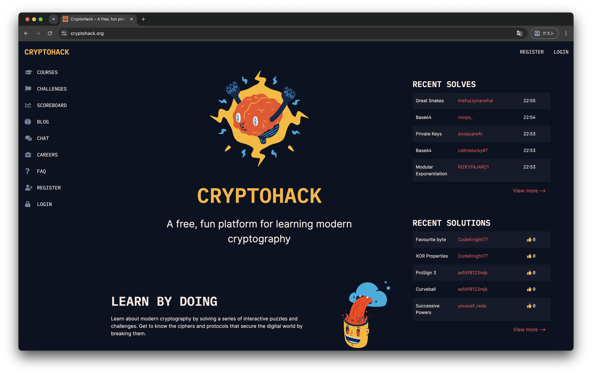

# 授業の進め方

## Crypto

講義で簡単な数学や暗号について取り扱います．

演習課題で講義の内容を元に Alpacahack や CryptoHack の問題を解きます．

### CryptoHack

[CryptoHack](https://cryptohack.org/) は暗号の問題のみを出題している常設型 CTF です．

前半の回は AlpacaHack ではなく CryptoHack を用いて演習を行います．

#### アカウント作成

https://cryptohack.org/register/　からアカウントを作成してください．

> Solve this Roman emperor's cipher:

は，"このシーザー暗号を解読してください" と言われています．

#### シーザー暗号

シーザー暗号は古代ローマの軍事的指導者ガイウス・ユリウス・カエサルによって考案された古典暗号です．

アルゴリズムはとてもシンプルで，秘匿したい文の各文字を辞書順に $n$ 文字分ずらすだけです．

つまり，$n$ 文字分を逆にずらすことで復号することができます．

## Web

Webアプリケーションの基本的な仕組みや脆弱性について取り扱います．

演習課題では、講義の内容を元に AlpacaHack の問題を解きます．
