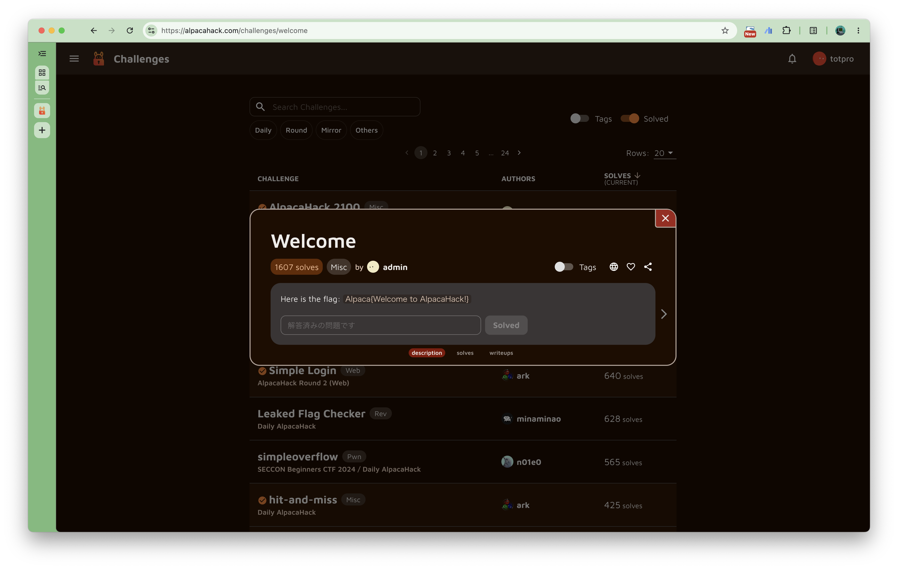
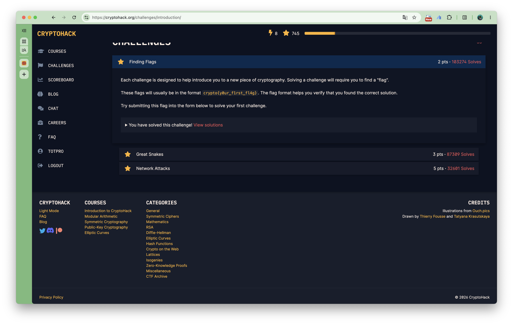

# 演習課題の提出について

AlpacaHack や CryptoHack の問題を解き，各プラットフォームで flag を提出してください．

それぞれ，以下の画像のような flag を提出する場所があります．

提出状況を確認するために，slack の DM で海賀宛に以下のフォーマットで学籍番号と各アカウントのユーザーID（ユーザーネーム）を送信してください．

```text
学籍番号 : s123456789
User ID (AlpacaHack): hoge
User ID (CryptoHack): fuga
```

## AlpacaHack



## CryptoHack

CryptoHack では一度解いた問題には再度 flag を提出できなくなっているので，以下の画像のようになっていますが，まだ解いていなければ flag が提出できるようになっています．


