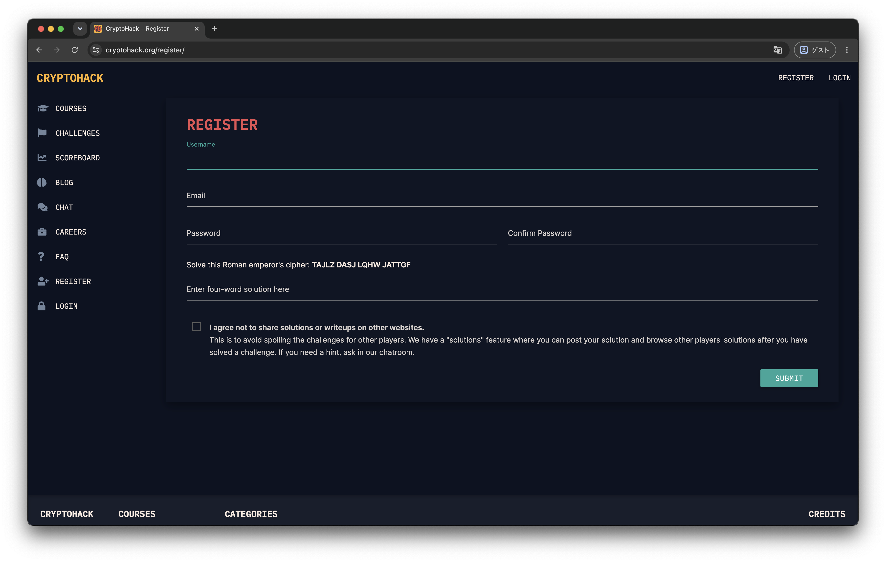

# 次回予告と課題

## 次回の内容

### Crypto

- 最大公約数を求めるコードを実装する．
- 拡張ユークリッドの互助法を理解し，実装する．

### Web

- curlの便利な使い方
- Cookie/Sessionの仕組み

## 今回の課題

### Crypto

1. CryptoHack のアカウント作成
    - アカウントを作成したら，slack の DM で海賀宛に各アカウントのユーザー ID を送信してください．[演習課題の提出について](./04_practice.mdx#演習課題の提出について) を参照．
    - https://cryptohack.org/challenges/introduction/ の Finding Flags．
2. https://alpacahack.com/challenges/welcome

#### ヒント
1. CryptoHack のアカウント作成

    https://cryptohack.org/register/ からアカウントを作成してください．
    
    
    
    > Solve this Roman emperor's cipher:
    
    は，"このシーザー暗号を解読してください" と言われています．

    シーザー暗号を解読するコードを自分で作成するか，外部サイト（[CyberChef](https://gchq.github.io/CyberChef/) など）を用いるなどしてください．
    
    #### シーザー暗号
    シーザー暗号は古代ローマの軍事的指導者ガイウス・ユリウス・カエサルによって考案された古典暗号です．
    
    アルゴリズムはとてもシンプルで，秘匿したい文（平文）の各文字を辞書順に $n$ 文字分ずらすだけです．
    つまり，$n$ 文字分を逆にずらすことで復号することができます．

    仮に $n$ がわからなくてもアルファベットは高々26個しか存在しないため，$n$ が1 ~ 26 の全ての場合を試す総当たり攻撃を行えば良い．

    ##### 例 $n=3$ の場合

    ```text
    | A | B | C |...| Y | Z | <- 平文
      |   |   |   |   |   | 辞書順に3文字ぶんずらす．
      ▼   ▼   ▼   ▼   ▼   ▼
    | D | E | F |...| B | C | <- 暗号文
    ```

    上の表を用いると
    平文 "HELLO WORLD" は暗号文 "KHOOR ZRUOG" となる．

### Web

#### 問題リンク

Bars（Easy）: [https://alpacahack.com/daily/challenges/bars](https://alpacahack.com/daily/challenges/bars)

#### 問題概要

Webページにflagが表示されていますが、JavaScriptで右クリック・文字選択・開発者ツール（F12）が無効化されています。

#### ヒント

1. JavaScriptによるイベント制限は、クライアント側でのみ動作します。
1. F12が無効化されていますが、他の方法でソースコードを確認できます

<details>
<summary>詳しいヒント</summary>

JavaScriptによるイベント制限（右クリック禁止、F12禁止等）はクライアント側でのみ動作するため、別の方法でソースコードを取得すれば回避できます。

- ブラウザのメニューバーから開発者ツールを開く
- curlで直接HTTPリクエストを送信する
- ページを保存してからソースを確認する
- JavaScriptを無効化する

などの方法でイベント制限を回避できます。

</details>

### 締め切り
次回講義の前日 23:59 まで．
