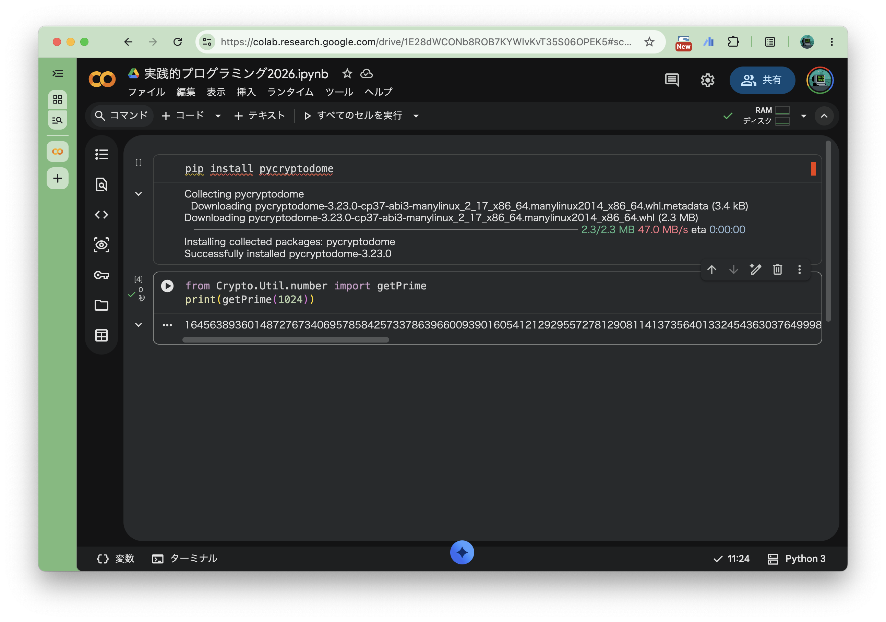

import Tabs from '@theme/Tabs';
import TabItem from '@theme/TabItem';

# 環境構築

すでに Python の環境があるという人は [必要なライブラリのインストール](#必要なライブラリのインストール) に進んでください．

CTF の Cyrpto カテゴリーでは，Python で実装された問題が多く出題されます．
そのため，暗号パートの演習では Python を使用します．

:::info

必ず Python を使用しなければならない，ということではないので強制はしませんが Python をお勧めします．

:::

## Python の実行環境

基本的には Python 3.10 以上がインストールされている環境であれば問題ありません．

### Google Colab

環境構築で悩みたくない場合は，[Google Colab](https://colab.research.google.com/) を使うのが一番簡単です．
- ブラウザだけで Python が動かせます．
- 必要なライブラリも簡単にインストールできます．

### ローカル環境

自分の PC に Python をインストールしてください．

<Tabs>
  <TabItem value="mac" label="macOS" default>

  Homebrew を使用してインストールするのが一般的です。

  ```bash
  brew install python
  ```

  インストール後，以下のコマンドでバージョンを確認してください．

  ```bash
  python3 --version
  ```

  </TabItem>
  
  <TabItem value="windows" label="Windows">

  [Python 公式サイト](https://www.python.org/downloads/windows/)からインストーラーをダウンロードして実行するか、Microsoft Store からインストールしてください。

  :::tip
  インストーラーを使用する場合、**"Add Python to PATH"** にチェックを入れるのを忘れないでください。
  :::

  インストール後，コマンドプロンプトや PowerShell で以下のコマンドを実行してバージョンを確認してください．

  ```bash
  python --version
  ```

  </TabItem>
  
  <TabItem value="linux" label="Linux">

  パッケージマネージャを使用してインストールしてください。

  ```bash
  # Ubuntu / Debian
  sudo apt update
  sudo apt install python3 python3-pip
  ```

  インストール後，以下のコマンドでバージョンを確認してください．

  ```bash
  python3 --version
  ```

  </TabItem>
</Tabs>


## 必要なライブラリのインストール

暗号の計算（特に RSA 暗号など）を便利にするために，`pycryptodome` というライブラリをよく使います．

Google Colab を使用する人はGoogle Colab のセルで，自身の PC や演習室環境等のローカル環境で行う人はターミナルで以下のコマンドを実行してインストールしてください．

```bash
pip install pycryptodome
```

### 動作確認

以下のコードを実行して，エラーが出なければ準備完了です．

```python
# pycryptodome の getPrime 関数を import
from Crypto.Util.number import getPrime
# getPrime 関数を用いて 1024 bits の素数を出力
print(getPrime(1024))
```

#### Google Colab での動作確認例


