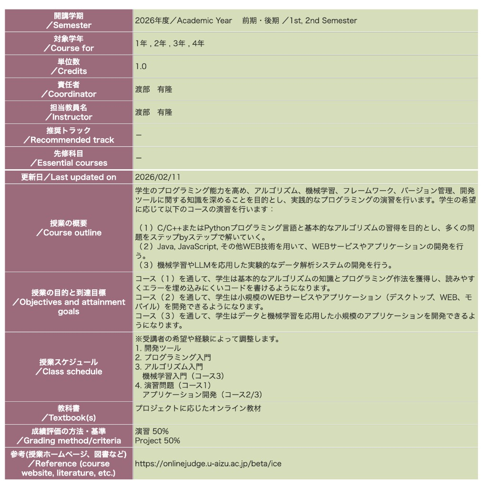
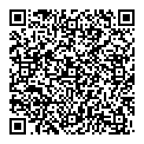

# 後期ガイダンス（授業紹介）

2026年度後期「実践的プログラミング」へようこそ！

## この授業について

本授業は、プログラミングの基礎を学び、実践的なプログラムを作成するための技術を身につけることを目的としています。前期に引き続き、課外授業として実践的にプログラミングを学んでいきます。

### 前期の内容（復習）

前期では、**C/C++プログラミング言語と基本的なアルゴリズム**を学びました。

- C言語の基礎文法
- データ構造（配列、構造体、ポインタ）
- 基本的なアルゴリズム（ソート、探索など）
- メモリ管理の基礎

### 後期の内容（これから決めます）

後期で学ぶ内容は、**みなさんのアンケート結果をもとに決定します**。以下の2つの方向性を候補として考えています。

- **アルゴリズム系**: C/C++またはPythonと基本的なアルゴリズムの習得を目的とし、多くの問題をステップbyステップで解いていく
- **Web開発系**: Java, JavaScript, その他WEB技術を用いて、WEBサービスやアプリケーションの開発を行う

:::tip[次のページでアンケートに回答してください]
後期で学びたい内容について、[アンケート](./survey)で希望を聞かせてください。結果をもとに今後の内容を決めます。
:::

## 講師

**伊藤 航大**

質問や相談があれば、授業中やSlackで気軽に声をかけてください。

## 生成AIについて

- 生成AIを使用する場合は、生成AIの使用に関する[ルール](https://u-aizu.ac.jp/files/cd87075ead451e35bcfebed5b79f71c88450a7d1.pdf)を守ってください
- 演習の際に生成AIを使用すること自体は問題ありません。しかし、すべて生成AIを使用したコードをそのまま提出することは禁止します。この授業は卒業認定単位を取得するための授業ではなく、課外授業として勉強するものです。そのため、生成AIを使用してコードを書いても、そのコードを理解していないと意味がありません。生成AIを使用してコードを書いた場合は、そのコードを理解し、自分で書き直して提出してください

## 連絡方法・使用するツールについて

### Slack

この授業ではSlackを使って連絡を取ります。

- 授業に関する質問
- 課題についての相談
- 技術的なディスカッション

#### Slackに参加しよう

前期から参加している人はそのまま同じワークスペースを使います。まだ参加していない人は、以下の招待リンク・QRコードから必ず参加してください。

https://join.slack.com/t/2026-wfa7449/shared_invite/zt-3un9r7t86-chTnC3C8u1GDmJbyWdRrvA

チャンネル: **#2026-practical-programming**

---

次のページでは、後期の内容を決めるためのアンケートに回答してもらいます。
